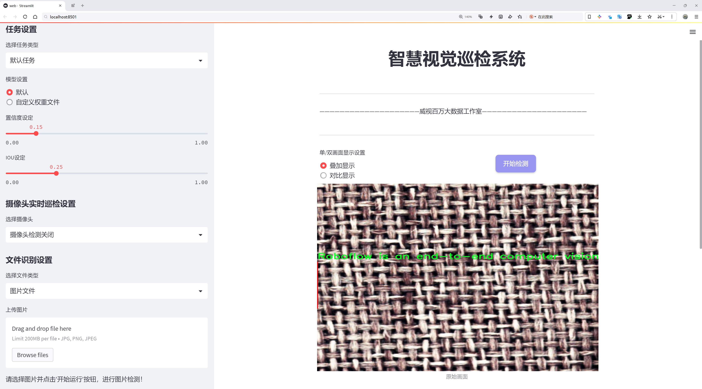
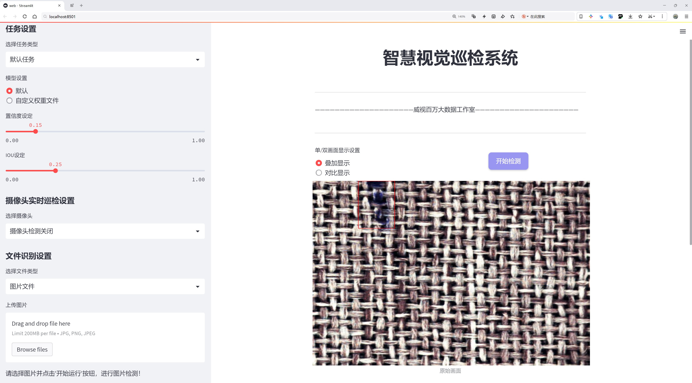
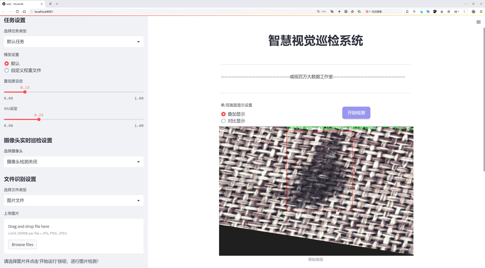
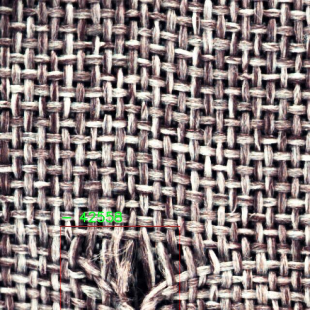
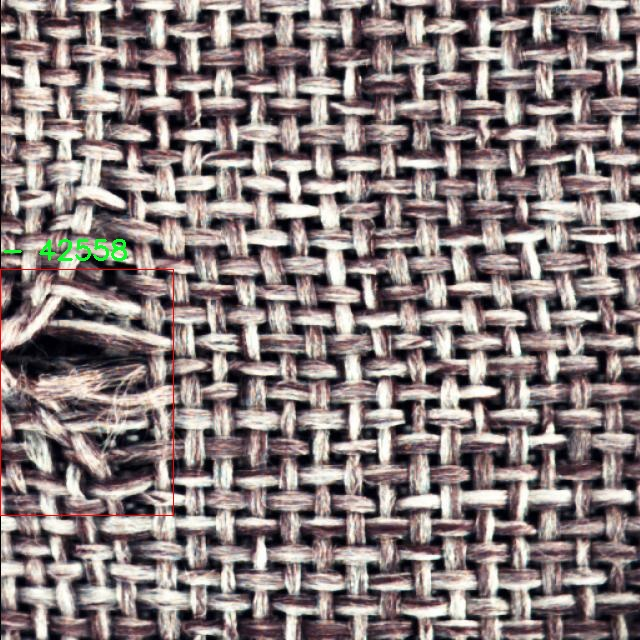
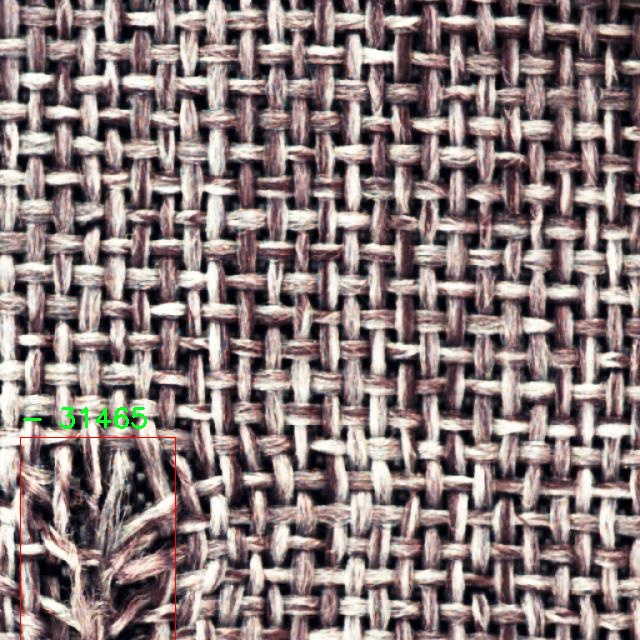
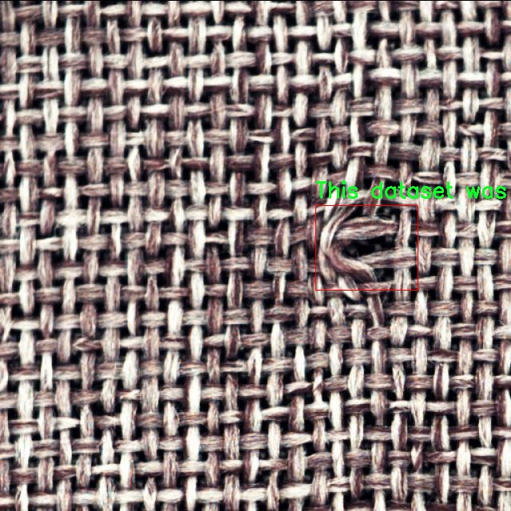
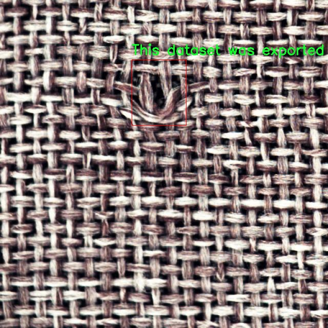

# 织物缺陷检测检测系统源码分享
 # [一条龙教学YOLOV8标注好的数据集一键训练_70+全套改进创新点发刊_Web前端展示]

### 1.研究背景与意义

项目参考[AAAI Association for the Advancement of Artificial Intelligence](https://gitee.com/qunshansj/projects)

项目来源[AACV Association for the Advancement of Computer Vision](https://gitee.com/qunmasj/projects)

研究背景与意义

随着纺织工业的快速发展，织物的质量控制变得愈发重要。织物缺陷不仅影响产品的外观和使用性能，还可能导致客户的不满和经济损失。因此，如何高效、准确地检测织物缺陷，成为了纺织行业亟待解决的技术难题。传统的织物缺陷检测方法主要依赖人工目视检查，虽然在小规模生产中可以实现，但随着生产规模的扩大和产品种类的多样化，人工检测的效率和准确性逐渐无法满足市场需求。此外，人工检测容易受到主观因素的影响，存在漏检和误检的风险。因此，开发一种高效、自动化的织物缺陷检测系统显得尤为重要。

近年来，深度学习技术的迅猛发展为图像处理领域带来了新的机遇。特别是目标检测算法的进步，使得机器能够在复杂的图像中识别和定位目标物体。YOLO（You Only Look Once）系列算法因其高效性和实时性，成为了目标检测领域的热门选择。YOLOv8作为该系列的最新版本，具备了更强的特征提取能力和更快的推理速度，为织物缺陷检测提供了良好的技术基础。然而，现有的YOLOv8模型在特定领域的应用上仍存在一定的局限性，尤其是在处理复杂背景和多样化缺陷类型时，模型的准确性和鲁棒性有待提高。因此，基于YOLOv8的改进，针对织物缺陷检测进行系统研究，具有重要的理论价值和实际意义。

本研究将利用一个包含2000张图像的织物缺陷检测数据集，专注于单一类别的缺陷识别。这一数据集为模型的训练和测试提供了丰富的样本，能够有效支持模型的学习过程。通过对YOLOv8进行改进，结合数据集的特性，旨在提升模型在织物缺陷检测中的准确性和实时性。具体而言，本研究将探讨如何通过数据增强、特征融合和模型优化等手段，提升YOLOv8在复杂织物图像中的表现，以期实现更高的检测精度和更低的误检率。

此外，织物缺陷检测系统的成功应用，不仅能够提高生产效率，降低人工成本，还能在一定程度上提升产品质量，增强企业的市场竞争力。随着智能制造和工业4.0的推进，自动化检测系统的需求将持续增长。因此，本研究的成果不仅具有学术价值，还具有广泛的应用前景，能够为纺织行业的智能化转型提供有力支持。

综上所述，基于改进YOLOv8的织物缺陷检测系统的研究，既是对现有技术的创新与提升，也是对纺织行业质量控制的有力响应。通过深入探索深度学习在织物缺陷检测中的应用，本研究将为相关领域的研究者和从业者提供新的思路和方法，推动织物检测技术的进步与发展。

### 2.图片演示







##### 注意：由于此博客编辑较早，上面“2.图片演示”和“3.视频演示”展示的系统图片或者视频可能为老版本，新版本在老版本的基础上升级如下：（实际效果以升级的新版本为准）

  （1）适配了YOLOV8的“目标检测”模型和“实例分割”模型，通过加载相应的权重（.pt）文件即可自适应加载模型。

  （2）支持“图片识别”、“视频识别”、“摄像头实时识别”三种识别模式。

  （3）支持“图片识别”、“视频识别”、“摄像头实时识别”三种识别结果保存导出，解决手动导出（容易卡顿出现爆内存）存在的问题，识别完自动保存结果并导出到tempDir中。

  （4）支持Web前端系统中的标题、背景图等自定义修改，后面提供修改教程。

  另外本项目提供训练的数据集和训练教程,暂不提供权重文件（best.pt）,需要您按照教程进行训练后实现图片演示和Web前端界面演示的效果。

### 3.视频演示

[3.1 视频演示](https://www.bilibili.com/video/BV1KZ4UekEoT/)

### 4.数据集信息展示

##### 4.1 本项目数据集详细数据（类别数＆类别名）

nc: 5
names: ['-', '- collaborate with your team on computer vision projects', 'Roboflow is an end-to-end computer vision platform that helps you', 'This dataset was exported via roboflow.com on April 17- 2024 at 5-24 AM GMT', 'mvtec-fabric-defect - v3 2024-03-10 3-45pm']


##### 4.2 本项目数据集信息介绍

数据集信息展示

在本研究中，我们采用了名为“fabric defect detection”的数据集，以改进YOLOv8的织物缺陷检测系统。该数据集专注于织物表面缺陷的识别与分类，旨在为计算机视觉领域提供高质量的训练数据，提升自动化检测的准确性和效率。数据集包含五个主要类别，尽管在类别名称的描述中存在一些不明确的信息，但这些类别涵盖了织物缺陷检测的关键方面。

首先，数据集的设计考虑到了织物缺陷的多样性和复杂性，确保模型能够在不同的环境和条件下进行有效的学习。通过丰富的样本数据，模型能够识别出多种类型的织物缺陷，包括但不限于色差、织物撕裂、污渍、编织不均匀等。这些缺陷在实际生产中常常影响产品的质量和美观，因此，准确的检测系统对于提升生产效率和降低返工率具有重要意义。

数据集的构建过程遵循了严格的标准，确保每个样本的标注准确无误。通过高质量的图像采集和专业的标注团队，数据集不仅包含了多种织物材料的缺陷图像，还考虑到了不同光照、角度和背景下的表现。这种多样性使得训练出的YOLOv8模型能够更好地适应实际应用场景，具备更强的泛化能力。

此外，该数据集的导出时间为2024年4月17日，显示出其相对的新颖性和时效性。随着织物生产技术的不断进步，织物缺陷的表现形式也在不断演变，因此，使用最新的数据集进行模型训练能够更好地反映当前市场的需求和挑战。我们相信，这一数据集的及时更新将为织物缺陷检测系统的持续改进提供坚实的基础。

在实际应用中，织物缺陷检测系统的准确性直接关系到产品的质量控制和客户满意度。通过对“fabric defect detection”数据集的深入分析和应用，我们期望能够实现更高的检测精度，降低误报率和漏报率。这不仅有助于提升生产线的自动化水平，还能为企业节省大量的人力和物力成本。

总之，“fabric defect detection”数据集为我们改进YOLOv8的织物缺陷检测系统提供了丰富的资源和强大的支持。通过对该数据集的有效利用，我们将能够推动织物缺陷检测技术的发展，为纺织行业的智能化转型贡献力量。未来，我们将继续探索更多的优化策略，以进一步提升模型的性能和实用性，为行业提供更为精准和高效的解决方案。











### 5.全套项目环境部署视频教程（零基础手把手教学）

[5.1 环境部署教程链接（零基础手把手教学）](https://www.ixigua.com/7404473917358506534?logTag=c807d0cbc21c0ef59de5)


[5.2 安装Python虚拟环境创建和依赖库安装视频教程链接（零基础手把手教学）](https://www.ixigua.com/7404474678003106304?logTag=1f1041108cd1f708b01a)

### 6.手把手YOLOV8训练视频教程（零基础小白有手就能学会）

[6.1 手把手YOLOV8训练视频教程（零基础小白有手就能学会）](https://www.ixigua.com/7404477157818401292?logTag=d31a2dfd1983c9668658)

### 7.70+种全套YOLOV8创新点代码加载调参视频教程（一键加载写好的改进模型的配置文件）

[7.1 70+种全套YOLOV8创新点代码加载调参视频教程（一键加载写好的改进模型的配置文件）](https://www.ixigua.com/7404478314661806627?logTag=29066f8288e3f4eea3a4)

### 8.70+种全套YOLOV8创新点原理讲解（非科班也可以轻松写刊发刊，V10版本正在科研待更新）

由于篇幅限制，每个创新点的具体原理讲解就不一一展开，具体见下列网址中的创新点对应子项目的技术原理博客网址【Blog】：


[8.1 70+种全套YOLOV8创新点原理讲解链接](https://gitee.com/qunmasj/good)

### 9.系统功能展示（检测对象为举例，实际内容以本项目数据集为准）

图9.1.系统支持检测结果表格显示

  图9.2.系统支持置信度和IOU阈值手动调节

  图9.3.系统支持自定义加载权重文件best.pt(需要你通过步骤5中训练获得)

  图9.4.系统支持摄像头实时识别

  图9.5.系统支持图片识别

  图9.6.系统支持视频识别

  图9.7.系统支持识别结果文件自动保存

  图9.8.系统支持Excel导出检测结果数据


### 10.原始YOLOV8算法原理

原始YOLOv8算法原理

YOLOv8作为YOLO系列的最新版本，承载着前几代模型的精髓，同时引入了一系列创新的设计理念和技术改进，使其在目标检测领域中表现出色。YOLO（You Only Look Once）算法的核心思想是将目标检测问题转化为一个回归问题，通过一个单一的神经网络模型来同时预测目标的位置和类别。YOLOv8在这一基础上，进一步优化了网络结构，提升了检测精度和速度。

YOLOv8的网络结构主要由三部分组成：Backbone、Neck和Head。Backbone部分负责特征提取，采用了CSPDarknet（Cross Stage Partial Darknet）结构，这种结构通过将网络分为两个部分，每个部分都包含多个残差块，能够有效地提取图像中的多层次特征。与前代模型YOLOv5相比，YOLOv8引入了C2f模块替代了C3模块。C2f模块的设计理念在于将输入的特征图分成两个分支，每个分支经过一个卷积层进行降维处理，同时引入了v8_C2fBottleneck层，使得特征图的输出也作为一个分支。这种多分支的设计能够丰富梯度流的信息，使得网络在特征提取时更加高效，最终形成更高维度的特征图。

在特征提取的过程中，YOLOv8还采用了快速空间金字塔池化（SPPF）结构，旨在提取不同尺度的特征。这一结构的引入不仅有效减少了模型的参数量和计算量，还显著提高了特征提取的效率。通过这种方式，YOLOv8能够在处理不同大小和形状的目标时，保持较高的检测精度。

Neck部分则采用了特征金字塔网络（FPN）和路径聚合网络（PAN）的结合结构，进一步增强了多尺度特征的融合能力。通过多个卷积层和池化层的组合，Neck部分将提取到的特征图进行处理和压缩，确保在不同层次上都能有效捕捉到目标信息。这种设计不仅提高了特征的表达能力，还增强了模型对复杂场景的适应性。

在Head部分，YOLOv8采用了解耦头（Decoupled Head）结构，将分类和回归任务分为两个独立的分支。这一创新的设计使得每个任务能够更加专注于自身的目标，从而有效解决了复杂场景下的定位不准和分类错误的问题。解耦头的引入，使得YOLOv8在处理多目标检测时，能够更好地平衡分类精度和定位精度。

值得一提的是，YOLOv8采用了一种基于无锚框（Anchor-Free）的检测方式，直接预测目标的中心点和宽高比例。这一方法相较于传统的锚框方法，简化了模型的设计，减少了锚框的数量，从而提高了检测速度和准确度。通过这种方式，YOLOv8能够更快地聚焦于目标位置的邻近点，使得预测框更接近于实际的边界框区域。

在数据预处理方面，YOLOv8延续了YOLOv5的策略，采用了包括马赛克增强、混合增强、空间扰动和颜色扰动等多种增强手段。这些数据增强技术的引入，不仅丰富了训练数据的多样性，还提高了模型的鲁棒性，使其在不同环境下都能保持较好的检测性能。

在标签分配策略上，YOLOv8采用了TOOD策略，这是一种动态标签分配方法。与YOLOv5的候选框聚类策略不同，YOLOv8的标签分配不依赖于数据集的特征分布，而是通过动态分配正负样本，确保模型在训练过程中能够有效学习到目标的特征。这一策略的引入，使得YOLOv8在处理多尺度目标时，能够更好地适应不同目标的尺寸和形状。

YOLOv8的损失函数设计也体现了其创新性。分类损失采用了变焦损失（VFL Loss），而回归损失则结合了CIoULoss与DFLLoss。这种损失函数的设计，能够更好地平衡正负样本的贡献，使得模型在训练过程中更加关注高质量的正样本，从而提升整体的检测精度。

总的来说，YOLOv8在原有YOLO系列的基础上，通过引入新的网络结构、特征提取方法和标签分配策略，显著提升了目标检测的准确性和速度。其高效的特征提取和目标检测方式，使得YOLOv8在实时检测应用中展现出强大的能力，能够满足现代计算机视觉任务的需求。随着YOLOv8的不断发展和完善，未来的目标检测技术将更加高效、精准，为各类应用场景提供更为可靠的解决方案。


### 11.项目核心源码讲解（再也不用担心看不懂代码逻辑）

#### 11.1 ui.py

以下是经过精简和注释的核心代码：

```python
import sys
import subprocess
from QtFusion.path import abs_path

def run_script(script_path):
    """
    使用当前 Python 环境运行指定的脚本。

    Args:
        script_path (str): 要运行的脚本路径
    """
    # 获取当前 Python 解释器的路径
    python_path = sys.executable

    # 构建运行命令，使用 streamlit 运行指定的脚本
    command = f'"{python_path}" -m streamlit run "{script_path}"'

    # 执行命令，并检查返回状态
    result = subprocess.run(command, shell=True)
    if result.returncode != 0:
        print("脚本运行出错。")

# 主程序入口
if __name__ == "__main__":
    # 获取脚本的绝对路径
    script_path = abs_path("web.py")

    # 运行指定的脚本
    run_script(script_path)
```

### 代码详细注释：

1. **导入模块**：
   - `sys`：用于访问与 Python 解释器紧密相关的变量和函数。
   - `subprocess`：用于执行外部命令。
   - `abs_path`：从 `QtFusion.path` 模块导入的函数，用于获取文件的绝对路径。

2. **定义 `run_script` 函数**：
   - 该函数接收一个脚本路径作为参数，并使用当前 Python 环境运行该脚本。
   - `python_path = sys.executable`：获取当前 Python 解释器的路径。
   - `command`：构建要执行的命令字符串，使用 `streamlit` 运行指定的脚本。
   - `subprocess.run(command, shell=True)`：执行构建的命令，并等待其完成。
   - 检查命令的返回状态，如果不为 0，表示脚本运行出错，打印错误信息。

3. **主程序入口**：
   - `if __name__ == "__main__":`：确保只有在直接运行该脚本时才会执行以下代码。
   - `script_path = abs_path("web.py")`：获取 `web.py` 脚本的绝对路径。
   - `run_script(script_path)`：调用 `run_script` 函数运行指定的脚本。

这个程序文件 `ui.py` 是一个用于运行 Python 脚本的简单工具，特别是用来启动一个 Streamlit 应用。首先，文件导入了必要的模块，包括 `sys`、`os` 和 `subprocess`，这些模块提供了与系统交互的功能。

在代码的开头，定义了一个名为 `run_script` 的函数。这个函数接受一个参数 `script_path`，它是要运行的脚本的路径。函数内部首先获取当前 Python 解释器的路径，使用 `sys.executable` 来实现。接着，构建一个命令字符串，这个命令将使用当前的 Python 环境来运行指定的脚本，具体是通过 `streamlit run` 命令来启动 Streamlit 应用。

然后，使用 `subprocess.run` 方法来执行这个命令。`shell=True` 参数表示命令将在一个新的 shell 中执行。执行后，函数检查返回的结果，如果返回码不为 0，表示脚本运行过程中出现了错误，此时会打印出“脚本运行出错”的提示。

在文件的最后部分，使用 `if __name__ == "__main__":` 语句来确保只有在直接运行这个文件时，以下代码才会被执行。在这里，指定了要运行的脚本路径，这里是 `web.py`，并调用 `run_script` 函数来执行这个脚本。

总的来说，这个程序的主要功能是通过当前的 Python 环境来运行一个指定的 Streamlit 脚本，提供了一种方便的方式来启动和管理 Streamlit 应用。

#### 11.2 code\ultralytics\utils\patches.py

以下是代码中最核心的部分，并附上详细的中文注释：

```python
import cv2
import numpy as np
import torch

# 读取图像的函数
def imread(filename: str, flags: int = cv2.IMREAD_COLOR):
    """
    从文件中读取图像。

    参数:
        filename (str): 要读取的文件路径。
        flags (int, optional): 标志，可以取cv2.IMREAD_*的值。默认为cv2.IMREAD_COLOR。

    返回:
        (np.ndarray): 读取的图像。
    """
    # 使用cv2.imdecode读取图像，np.fromfile用于处理文件路径中的中文字符
    return cv2.imdecode(np.fromfile(filename, np.uint8), flags)

# 写入图像的函数
def imwrite(filename: str, img: np.ndarray, params=None):
    """
    将图像写入文件。

    参数:
        filename (str): 要写入的文件路径。
        img (np.ndarray): 要写入的图像。
        params (list of ints, optional): 额外的参数。请参见OpenCV文档。

    返回:
        (bool): 如果文件写入成功返回True，否则返回False。
    """
    try:
        # 使用cv2.imencode将图像编码并写入文件，Path(filename).suffix获取文件后缀
        cv2.imencode(Path(filename).suffix, img, params)[1].tofile(filename)
        return True
    except Exception:
        return False

# 显示图像的函数
def imshow(winname: str, mat: np.ndarray):
    """
    在指定窗口中显示图像。

    参数:
        winname (str): 窗口的名称。
        mat (np.ndarray): 要显示的图像。
    """
    # 使用cv2.imshow显示图像，窗口名称进行编码以避免Unicode错误
    cv2.imshow(winname.encode("unicode_escape").decode(), mat)

# PyTorch保存模型的函数
def torch_save(*args, **kwargs):
    """
    使用dill（如果存在）序列化lambda函数，因为pickle无法处理。同时增加3次重试，
    以指数退避的方式处理保存失败，提高对瞬时问题的鲁棒性。

    参数:
        *args (tuple): 传递给torch.save的位置参数。
        **kwargs (dict): 传递给torch.save的关键字参数。
    """
    try:
        import dill as pickle  # 尝试导入dill模块
    except ImportError:
        import pickle  # 如果dill不可用，则使用pickle

    # 如果kwargs中没有pickle_module，则添加
    if "pickle_module" not in kwargs:
        kwargs["pickle_module"] = pickle

    for i in range(4):  # 进行3次重试
        try:
            return torch.save(*args, **kwargs)  # 调用torch.save保存模型
        except RuntimeError:  # 如果保存失败，可能是设备未刷新或防病毒软件正在扫描
            if i == 3:
                raise  # 如果是最后一次重试，则抛出异常
            time.sleep((2**i) / 2)  # 指数退避：0.5s, 1.0s, 2.0s
```

### 代码说明：
1. **imread**: 读取图像文件并返回为NumPy数组，支持中文路径。
2. **imwrite**: 将NumPy数组图像写入指定文件，支持指定编码参数。
3. **imshow**: 在窗口中显示图像，处理窗口名称的编码以避免Unicode错误。
4. **torch_save**: 封装PyTorch的保存函数，支持dill序列化和重试机制，以提高保存模型的可靠性。

这个程序文件 `patches.py` 是用于增强和扩展现有功能的猴子补丁（monkey patches），主要涉及图像处理和模型保存的功能。文件中使用了 OpenCV 和 PyTorch 库，提供了一些自定义的函数来替代或扩展这些库的默认功能。

首先，文件导入了一些必要的库，包括 `cv2`（OpenCV的Python接口）、`numpy`（用于处理数组）、`torch`（PyTorch库）以及 `time` 和 `Path`（用于文件路径处理）。接着，定义了一些图像处理的函数。

`imread` 函数用于从文件中读取图像。它接受文件名和标志参数，默认情况下使用彩色模式读取图像。该函数使用 `cv2.imdecode` 方法来解码图像数据，并返回一个 NumPy 数组表示的图像。

`imwrite` 函数用于将图像写入文件。它接受文件名、图像数组和可选的参数列表。该函数使用 `cv2.imencode` 方法将图像编码为指定格式，并使用 `tofile` 方法将其写入文件。函数在写入过程中捕获异常，如果成功写入返回 `True`，否则返回 `False`。

`imshow` 函数用于在指定窗口中显示图像。它接受窗口名称和图像数组作为参数。为了避免递归错误，该函数调用了 `_imshow`，并对窗口名称进行了编码和解码处理，以确保在多语言环境下的兼容性。

接下来，文件定义了一个用于保存 PyTorch 模型的函数 `torch_save`。该函数的目的是增强模型保存的可靠性，特别是在使用 lambda 函数时，默认的 `pickle` 可能无法序列化它们。该函数首先尝试导入 `dill` 模块（如果可用），否则使用标准的 `pickle`。在保存模型时，如果遇到运行时错误（例如设备未准备好或防病毒软件正在扫描），该函数会进行最多三次重试，每次重试之间有指数级的延迟，以提高成功保存的可能性。

总的来说，这个文件通过自定义函数来增强 OpenCV 和 PyTorch 的功能，提供了更好的图像读取、写入和模型保存的能力，尤其是在处理多语言和潜在的错误时。

#### 11.3 70+种YOLOv8算法改进源码大全和调试加载训练教程（非必要）\ultralytics\models\fastsam\__init__.py

以下是保留的核心代码部分，并添加了详细的中文注释：

```python
# 导入所需的模块和类
from .model import FastSAM  # 导入FastSAM模型类
from .predict import FastSAMPredictor  # 导入FastSAMPredictor预测类
from .prompt import FastSAMPrompt  # 导入FastSAMPrompt提示类
from .val import FastSAMValidator  # 导入FastSAMValidator验证类

# 定义模块的公开接口，指定可以被外部访问的类
__all__ = 'FastSAMPredictor', 'FastSAM', 'FastSAMPrompt', 'FastSAMValidator'
```

### 代码注释说明：
1. **模块导入**：
   - 代码中通过相对导入的方式引入了多个类，这些类分别负责模型的构建、预测、提示和验证等功能。
   - `FastSAM` 是模型的核心类，负责定义和训练模型。
   - `FastSAMPredictor` 类用于进行模型的预测，处理输入数据并输出结果。
   - `FastSAMPrompt` 类可能用于生成提示信息或处理用户输入。
   - `FastSAMValidator` 类用于验证模型的性能，评估模型的准确性和有效性。

2. **`__all__` 变量**：
   - `__all__` 是一个特殊变量，用于定义模块的公共接口。当使用 `from module import *` 时，只有在 `__all__` 中列出的名称会被导入。
   - 这里列出了四个类，表示这些类是该模块的主要功能部分，外部用户可以直接使用它们。

这个程序文件是一个Python模块的初始化文件，通常用于定义模块的公共接口。在这个文件中，首先有一个注释，表明这是Ultralytics YOLO项目的一部分，并且该项目遵循AGPL-3.0许可证。

接下来，文件通过相对导入的方式引入了四个类或函数：`FastSAM`、`FastSAMPredictor`、`FastSAMPrompt`和`FastSAMValidator`。这些类或函数分别来自于同一模块下的不同文件。具体来说，`FastSAM`可能是实现了某种模型的核心类，`FastSAMPredictor`可能用于进行预测，`FastSAMPrompt`可能与输入提示或交互相关，而`FastSAMValidator`则可能用于验证模型的性能或结果。

最后，`__all__`变量被定义为一个包含字符串的元组，这些字符串代表了该模块公开的接口部分。这意味着当使用`from module import *`的方式导入该模块时，只会导入`FastSAMPredictor`、`FastSAM`、`FastSAMPrompt`和`FastSAMValidator`这四个类或函数，其他未列出的内容将不会被导入。这种做法有助于控制模块的命名空间，避免不必要的命名冲突，同时也提高了模块的可读性和可维护性。

#### 11.4 70+种YOLOv8算法改进源码大全和调试加载训练教程（非必要）\ultralytics\__init__.py

以下是代码中最核心的部分，并附上详细的中文注释：

```python
# 导入Ultralytics YOLO库，遵循AGPL-3.0许可证

# 定义当前版本
__version__ = '8.0.202'

# 从ultralytics.models模块导入不同的模型
from ultralytics.models import RTDETR, SAM, YOLO  # 导入实时目标检测模型RTDETR、分割模型SAM和YOLO模型
from ultralytics.models.fastsam import FastSAM  # 导入快速分割模型FastSAM
from ultralytics.models.nas import NAS  # 导入神经架构搜索模型NAS

# 导入设置和检查工具
from ultralytics.utils import SETTINGS as settings  # 导入设置
from ultralytics.utils.checks import check_yolo as checks  # 导入YOLO模型检查工具
from ultralytics.utils.downloads import download  # 导入下载工具

# 定义模块的公共接口，允许外部访问的内容
__all__ = '__version__', 'YOLO', 'NAS', 'SAM', 'FastSAM', 'RTDETR', 'checks', 'download', 'settings'
```

### 注释说明：
1. **版本定义**：`__version__` 用于标识当前库的版本号，方便用户和开发者了解使用的版本。
2. **模型导入**：通过 `from` 语句导入不同的模型，这些模型是进行目标检测和图像分割的核心组件。
3. **工具导入**：导入设置、检查和下载工具，帮助用户进行模型的配置、验证和资源下载。
4. **公共接口**：`__all__` 定义了模块的公共接口，只有在这个列表中的内容才能被外部访问，这有助于封装和保护模块内部实现。

这个程序文件是Ultralytics YOLO（You Only Look Once）算法的一个初始化模块，主要用于导入和管理与YOLOv8相关的功能和组件。文件的开头部分包含了版权信息和版本号，表明该代码遵循AGPL-3.0许可证，并且当前版本为8.0.202。

接下来，文件从`ultralytics.models`模块中导入了多个模型，包括RTDETR、SAM和YOLO。这些模型是YOLOv8算法的不同实现或变种，可能针对不同的任务或应用场景进行了优化。此外，还导入了`FastSAM`和`NAS`，这表明该库可能还支持快速的SAM模型和神经架构搜索（NAS）相关的功能。

在工具函数方面，文件导入了`SETTINGS`作为`settings`，这可能包含了与模型配置和运行相关的设置选项。同时，`check_yolo`函数被导入为`checks`，用于检查YOLO模型的有效性或兼容性。`download`函数则用于处理模型或数据的下载操作。

最后，`__all__`变量定义了该模块的公共接口，列出了可以被外部访问的组件。这包括版本号、各个模型类、检查函数、下载函数以及设置选项。通过这种方式，用户可以方便地使用这些功能，而不需要直接访问模块内部的实现细节。

总的来说，这个文件的主要作用是组织和暴露YOLOv8相关的模型和工具，方便用户进行深度学习模型的训练和推理。

#### 11.5 train.py

以下是经过简化和注释的核心代码部分：

```python
import random
import numpy as np
import torch.nn as nn
from ultralytics.data import build_dataloader, build_yolo_dataset
from ultralytics.engine.trainer import BaseTrainer
from ultralytics.models import yolo
from ultralytics.nn.tasks import DetectionModel
from ultralytics.utils import LOGGER, RANK
from ultralytics.utils.torch_utils import de_parallel, torch_distributed_zero_first

class DetectionTrainer(BaseTrainer):
    """
    扩展自 BaseTrainer 类，用于基于检测模型的训练。
    """

    def build_dataset(self, img_path, mode="train", batch=None):
        """
        构建 YOLO 数据集。

        参数:
            img_path (str): 包含图像的文件夹路径。
            mode (str): 模式，`train` 或 `val`，用户可以为每种模式自定义不同的增强。
            batch (int, optional): 批次大小，仅用于 `rect` 模式。默认为 None。
        """
        gs = max(int(de_parallel(self.model).stride.max() if self.model else 0), 32)
        return build_yolo_dataset(self.args, img_path, batch, self.data, mode=mode, rect=mode == "val", stride=gs)

    def get_dataloader(self, dataset_path, batch_size=16, rank=0, mode="train"):
        """构造并返回数据加载器。"""
        assert mode in ["train", "val"]
        with torch_distributed_zero_first(rank):  # 仅在 DDP 中初始化数据集 *.cache 一次
            dataset = self.build_dataset(dataset_path, mode, batch_size)
        shuffle = mode == "train"  # 训练模式下打乱数据
        workers = self.args.workers if mode == "train" else self.args.workers * 2
        return build_dataloader(dataset, batch_size, workers, shuffle, rank)  # 返回数据加载器

    def preprocess_batch(self, batch):
        """对一批图像进行预处理，包括缩放和转换为浮点数。"""
        batch["img"] = batch["img"].to(self.device, non_blocking=True).float() / 255  # 归一化到 [0, 1]
        if self.args.multi_scale:  # 如果启用多尺度
            imgs = batch["img"]
            sz = (
                random.randrange(self.args.imgsz * 0.5, self.args.imgsz * 1.5 + self.stride)
                // self.stride
                * self.stride
            )  # 随机选择新的尺寸
            sf = sz / max(imgs.shape[2:])  # 计算缩放因子
            if sf != 1:
                ns = [
                    math.ceil(x * sf / self.stride) * self.stride for x in imgs.shape[2:]
                ]  # 计算新的形状
                imgs = nn.functional.interpolate(imgs, size=ns, mode="bilinear", align_corners=False)  # 进行插值
            batch["img"] = imgs
        return batch

    def set_model_attributes(self):
        """设置模型的属性，包括类别数量和名称。"""
        self.model.nc = self.data["nc"]  # 将类别数量附加到模型
        self.model.names = self.data["names"]  # 将类别名称附加到模型
        self.model.args = self.args  # 将超参数附加到模型

    def get_model(self, cfg=None, weights=None, verbose=True):
        """返回 YOLO 检测模型。"""
        model = DetectionModel(cfg, nc=self.data["nc"], verbose=verbose and RANK == -1)
        if weights:
            model.load(weights)  # 加载权重
        return model

    def plot_training_samples(self, batch, ni):
        """绘制带有注释的训练样本。"""
        plot_images(
            images=batch["img"],
            batch_idx=batch["batch_idx"],
            cls=batch["cls"].squeeze(-1),
            bboxes=batch["bboxes"],
            paths=batch["im_file"],
            fname=self.save_dir / f"train_batch{ni}.jpg",
            on_plot=self.on_plot,
        )
```

### 代码注释说明：
1. **导入必要的库**：导入了处理数据、构建模型和绘图所需的库。
2. **DetectionTrainer 类**：这是一个继承自 `BaseTrainer` 的类，专门用于训练检测模型。
3. **build_dataset 方法**：根据输入的图像路径和模式构建 YOLO 数据集。
4. **get_dataloader 方法**：构造数据加载器，负责加载训练或验证数据。
5. **preprocess_batch 方法**：对输入的图像批次进行预处理，包括归一化和多尺度调整。
6. **set_model_attributes 方法**：设置模型的类别数量和名称。
7. **get_model 方法**：返回一个 YOLO 检测模型，并可选择加载预训练权重。
8. **plot_training_samples 方法**：绘制训练样本及其对应的标注信息，便于可视化训练过程。

这个程序文件 `train.py` 是一个用于训练 YOLO（You Only Look Once）目标检测模型的脚本，继承自 `BaseTrainer` 类。程序的主要功能是构建数据集、获取数据加载器、预处理图像批次、设置模型属性、获取模型、进行模型验证、记录损失、显示训练进度、绘制训练样本和指标等。

首先，程序导入了必要的库和模块，包括数学运算、随机数生成、深度学习框架 PyTorch 的神经网络模块、Ultralytics 提供的各种工具和模型等。接着定义了 `DetectionTrainer` 类，该类用于处理目标检测任务的训练过程。

在 `build_dataset` 方法中，程序根据传入的图像路径和模式（训练或验证）构建 YOLO 数据集。该方法会根据模型的步幅计算出合适的图像大小，并调用 `build_yolo_dataset` 函数来创建数据集。

`get_dataloader` 方法用于构建数据加载器。它根据模式（训练或验证）初始化数据集，并设置是否打乱数据的顺序。训练模式下，数据会被打乱，而验证模式下则不会。

`preprocess_batch` 方法负责对图像批次进行预处理，包括将图像缩放到合适的大小并转换为浮点数格式。它还支持多尺度训练，通过随机选择图像大小来增强模型的鲁棒性。

`set_model_attributes` 方法用于设置模型的属性，包括类别数量和类别名称等，以确保模型与数据集的匹配。

`get_model` 方法返回一个 YOLO 检测模型实例，并可选择加载预训练权重。

`get_validator` 方法返回一个用于模型验证的 `DetectionValidator` 实例，以便在训练过程中评估模型性能。

`label_loss_items` 方法用于返回一个包含训练损失项的字典，便于后续的损失记录和分析。

`progress_string` 方法生成一个格式化的字符串，用于显示训练进度，包括当前的训练轮次、GPU 内存使用情况、损失值、实例数量和图像大小等信息。

`plot_training_samples` 方法用于绘制训练样本及其标注，便于可视化训练过程中的数据。

最后，`plot_metrics` 和 `plot_training_labels` 方法分别用于绘制训练过程中记录的指标和标签，以便分析模型的训练效果。

总体而言，这个文件提供了一个完整的训练流程，涵盖了数据处理、模型训练、验证和结果可视化等多个方面，旨在帮助用户高效地训练 YOLO 目标检测模型。

#### 11.6 code\ultralytics\utils\callbacks\wb.py

以下是代码中最核心的部分，并附上详细的中文注释：

```python
# 导入必要的库
import numpy as np
import pandas as pd
import wandb as wb  # 导入wandb库用于实验管理和可视化

_processed_plots = {}  # 用于记录已处理的图表，避免重复记录

def _custom_table(x, y, classes, title="Precision Recall Curve", x_title="Recall", y_title="Precision"):
    """
    创建并记录自定义的精确度-召回率曲线可视化。

    Args:
        x (List): x轴的值，长度为N。
        y (List): y轴的值，长度为N。
        classes (List): 每个点的类别标签，长度为N。
        title (str, optional): 图表标题，默认为'Precision Recall Curve'。
        x_title (str, optional): x轴标签，默认为'Recall'。
        y_title (str, optional): y轴标签，默认为'Precision'。

    Returns:
        (wandb.Object): 适合记录的wandb对象，展示自定义的可视化。
    """
    # 创建一个数据框，包含类别、y值和x值
    df = pd.DataFrame({"class": classes, "y": y, "x": x}).round(3)
    fields = {"x": "x", "y": "y", "class": "class"}
    string_fields = {"title": title, "x-axis-title": x_title, "y-axis-title": y_title}
    
    # 使用wandb记录表格
    return wb.plot_table(
        "wandb/area-under-curve/v0", wb.Table(dataframe=df), fields=fields, string_fields=string_fields
    )

def _plot_curve(x, y, names=None, id="precision-recall", title="Precision Recall Curve", x_title="Recall", y_title="Precision", num_x=100, only_mean=False):
    """
    记录一个度量曲线的可视化。

    Args:
        x (np.ndarray): x轴的数据点，长度为N。
        y (np.ndarray): y轴的数据点，形状为CxN，C为类别数量。
        names (list, optional): y轴数据对应的类别名称，长度为C。
        id (str, optional): 在wandb中记录数据的唯一标识符，默认为'precision-recall'。
        title (str, optional): 可视化图表的标题，默认为'Precision Recall Curve'。
        x_title (str, optional): x轴的标签，默认为'Recall'。
        y_title (str, optional): y轴的标签，默认为'Precision'。
        num_x (int, optional): 可视化的插值数据点数量，默认为100。
        only_mean (bool, optional): 指示是否仅绘制均值曲线的标志，默认为True。

    Note:
        该函数利用'_custom_table'函数生成实际的可视化。
    """
    # 创建新的x值
    if names is None:
        names = []
    x_new = np.linspace(x[0], x[-1], num_x).round(5)

    # 创建用于记录的数组
    x_log = x_new.tolist()
    y_log = np.interp(x_new, x, np.mean(y, axis=0)).round(3).tolist()

    if only_mean:
        # 仅记录均值曲线
        table = wb.Table(data=list(zip(x_log, y_log)), columns=[x_title, y_title])
        wb.run.log({title: wb.plot.line(table, x_title, y_title, title=title)})
    else:
        # 记录每个类别的曲线
        classes = ["mean"] * len(x_log)
        for i, yi in enumerate(y):
            x_log.extend(x_new)  # 添加新的x值
            y_log.extend(np.interp(x_new, x, yi))  # 将y插值到新的x
            classes.extend([names[i]] * len(x_new))  # 添加类别名称
        wb.log({id: _custom_table(x_log, y_log, classes, title, x_title, y_title)}, commit=False)

def on_fit_epoch_end(trainer):
    """在每个训练周期结束时记录训练指标和模型信息。"""
    wb.run.log(trainer.metrics, step=trainer.epoch + 1)  # 记录当前周期的指标
    # 记录训练和验证过程中的图表
    _log_plots(trainer.plots, step=trainer.epoch + 1)
    _log_plots(trainer.validator.plots, step=trainer.epoch + 1)
    if trainer.epoch == 0:
        wb.run.log(model_info_for_loggers(trainer), step=trainer.epoch + 1)  # 记录模型信息

def on_train_end(trainer):
    """在训练结束时保存最佳模型作为artifact。"""
    _log_plots(trainer.validator.plots, step=trainer.epoch + 1)  # 记录验证过程中的图表
    _log_plots(trainer.plots, step=trainer.epoch + 1)  # 记录训练过程中的图表
    art = wb.Artifact(type="model", name=f"run_{wb.run.id}_model")  # 创建模型artifact
    if trainer.best.exists():
        art.add_file(trainer.best)  # 添加最佳模型文件
        wb.run.log_artifact(art, aliases=["best"])  # 记录artifact
    # 记录每个曲线的可视化
    for curve_name, curve_values in zip(trainer.validator.metrics.curves, trainer.validator.metrics.curves_results):
        x, y, x_title, y_title = curve_values
        _plot_curve(
            x,
            y,
            names=list(trainer.validator.metrics.names.values()),
            id=f"curves/{curve_name}",
            title=curve_name,
            x_title=x_title,
            y_title=y_title,
        )
    wb.run.finish()  # 结束wandb运行
```

### 代码核心部分说明：
1. **导入库**：导入必要的库，包括 `numpy`、`pandas` 和 `wandb`，用于数据处理和实验管理。
2. **自定义表格函数**：`_custom_table` 函数用于创建并记录精确度-召回率曲线的可视化。
3. **绘制曲线函数**：`_plot_curve` 函数根据输入数据生成度量曲线，并记录到 `wandb`。
4. **训练周期结束时的记录**：`on_fit_epoch_end` 函数在每个训练周期结束时记录训练指标和模型信息。
5. **训练结束时的处理**：`on_train_end` 函数在训练结束时保存最佳模型，并记录验证和训练过程中的图表。

这个程序文件是一个用于集成WandB（Weights and Biases）库的回调模块，主要用于在训练YOLO模型时记录和可视化训练过程中的各种指标和图表。首先，文件导入了一些必要的库和模块，包括Ultralytics的设置和工具函数。接着，它尝试验证WandB的可用性，确保在运行测试时不会记录日志，并检查WandB的设置是否启用。

文件中定义了几个主要的函数。`_custom_table`函数用于创建并记录一个自定义的精确度-召回曲线图，允许用户自定义图表的标题和轴标签。它接收x轴和y轴的数据，以及类标签，并将这些数据封装成一个数据框，然后使用WandB的API生成图表。

`_plot_curve`函数则用于记录一个指标曲线的可视化。它可以根据输入的数据生成曲线，并将其记录到WandB中。这个函数可以选择只绘制平均曲线或每个类的曲线，具体取决于`only_mean`参数的设置。

`_log_plots`函数负责记录输入字典中的图表，如果这些图表在指定的步骤中尚未记录过，它会将图表添加到WandB的日志中。

接下来的几个函数是训练过程中的回调函数。`on_pretrain_routine_start`在预训练例程开始时被调用，用于初始化WandB项目。`on_fit_epoch_end`在每个训练周期结束时记录训练指标和模型信息。`on_train_epoch_end`在每个训练周期结束时记录标签损失和学习率，并在特定条件下记录图表。`on_train_end`则在训练结束时保存最佳模型，并记录验证器的图表和曲线。

最后，程序定义了一个回调字典`callbacks`，该字典包含了在训练过程中会被调用的回调函数，只有在WandB可用时才会包含这些回调。这些回调函数将帮助用户更好地监控和分析模型的训练过程。

### 12.系统整体结构（节选）

### 整体功能和构架概括

该项目是一个针对YOLOv8目标检测算法的实现和改进，包含多个模块和工具，用于模型的训练、推理、数据处理和可视化。项目的架构设计良好，模块化程度高，便于扩展和维护。主要功能包括：

1. **模型训练**：提供了训练YOLOv8模型的完整流程，包括数据集构建、数据加载、模型初始化、训练过程监控等。
2. **模型推理**：支持对图像或视频进行目标检测和分割，提供了相应的推理接口。
3. **数据处理**：包括图像读取、写入和预处理的工具函数，确保数据的高效处理。
4. **可视化和监控**：集成了WandB等工具，用于实时监控训练过程中的指标和结果，便于分析和调优。
5. **扩展性**：通过模块化设计，用户可以方便地添加新的功能或改进现有功能。

### 文件功能整理表

| 文件路径                                                                                     | 功能描述                                                                                           |
|----------------------------------------------------------------------------------------------|----------------------------------------------------------------------------------------------------|
| `D:\tools\20240809\code\ui.py`                                                              | 启动Streamlit应用，提供一个用户界面来运行YOLOv8模型的训练和推理。                                |
| `D:\tools\20240809\code\code\ultralytics\utils\patches.py`                                | 提供图像读取、写入和模型保存的自定义函数，增强OpenCV和PyTorch的功能。                             |
| `D:\tools\20240809\code\70+种YOLOv8算法改进源码大全和调试加载训练教程（非必要）\ultralytics\models\fastsam\__init__.py` | 初始化FastSAM模块，导入相关类和函数，构建模块的公共接口。                                         |
| `D:\tools\20240809\code\70+种YOLOv8算法改进源码大全和调试加载训练教程（非必要）\ultralytics\__init__.py` | 初始化Ultralytics模块，导入YOLO及其他模型，提供公共接口和工具函数。                             |
| `D:\tools\20240809\code\train.py`                                                          | 定义YOLO模型的训练流程，包括数据集构建、数据加载、模型训练和验证等功能。                       |
| `D:\tools\20240809\code\code\ultralytics\utils\callbacks\wb.py`                          | 集成WandB库，用于记录和可视化训练过程中的指标和图表，提供训练监控功能。                          |
| `D:\tools\20240809\code\70+种YOLOv8算法改进源码大全和调试加载训练教程（非必要）\ultralytics\models\yolo\segment\train.py` | 处理YOLO模型的分割任务的训练过程，包含特定于分割的训练逻辑。                                    |
| `D:\tools\20240809\code\code\ultralytics\trackers\utils\kalman_filter.py`                | 实现卡尔曼滤波器，用于目标跟踪任务，提供目标位置和速度的估计。                                  |
| `D:\tools\20240809\code\70+种YOLOv8算法改进源码大全和调试加载训练教程（非必要）\ultralytics\models\yolo\pose\train.py` | 处理YOLO模型的姿态估计任务的训练过程，包含特定于姿态估计的训练逻辑。                            |
| `D:\tools\20240809\code\code\ultralytics\models\nas\predict.py`                          | 实现神经架构搜索（NAS）相关的推理功能，支持自动化模型选择和优化。                                |
| `D:\tools\20240809\code\70+种YOLOv8算法改进源码大全和调试加载训练教程（非必要）\ultralytics\utils\files.py` | 提供文件操作的工具函数，包括文件读取、写入和路径处理等功能。                                    |
| `D:\tools\20240809\code\70+种YOLOv8算法改进源码大全和调试加载训练教程（非必要）\ultralytics\nn\backbone\convnextv2.py` | 实现ConvNeXtV2模型的定义和相关功能，作为YOLO模型的骨干网络之一。                               |
| `D:\tools\20240809\code\code\ultralytics\nn\modules\utils.py`                             | 提供神经网络模块的实用工具函数，支持模型构建和操作的辅助功能。                                   |

这个表格总结了每个文件的主要功能，帮助理解项目的整体结构和各个模块的作用。

注意：由于此博客编辑较早，上面“11.项目核心源码讲解（再也不用担心看不懂代码逻辑）”中部分代码可能会优化升级，仅供参考学习，完整“训练源码”、“Web前端界面”和“70+种创新点源码”以“13.完整训练+Web前端界面+70+种创新点源码、数据集获取”的内容为准。

### 13.完整训练+Web前端界面+70+种创新点源码、数据集获取


# [下载链接：https://mbd.pub/o/bread/ZpuVmp1s](https://mbd.pub/o/bread/ZpuVmp1s)